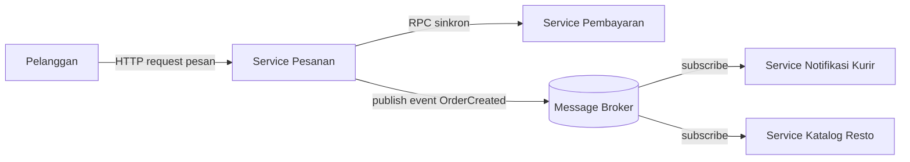

# Tugas 2 (Pekan 2) — Perancangan Arsitektur untuk FoodGo

**Materi terkait:** Architectural style (Layered, SOA, Peer-to-Peer, Publish-Subscribe).

## Studi Kasus

Melanjutkan Tugas 1: FoodGo butuh sistem yang **decoupled** agar tim kurir dan tim resto tidak saling mengganggu ketika salah satu modul diperbarui/deploy ulang. Saat ini semua modul (pesanan, pembayaran, notifikasi kurir, katalog resto) berjalan sebagai satu aplikasi monolitik — sekali deploy, semua modul ikut restart dan berisiko downtime total.

## Tugas Kelompok

1. **Pilih satu gaya arsitektur utama:** Service-Oriented Architecture (SOA) atau Publish-Subscribe. Boleh dikombinasikan (mis. SOA untuk service inti + Pub-Sub untuk notifikasi), tapi harus dijustifikasi kenapa kombinasi ini yang dipilih.

   Jawab :
   
   Berdasarkan hasil analisis Tugas 1, masalah utama FoodGo terletak pada arsitektur monolitik yang menjadi *Single Point of Failure* (SPOF). Seluruh modul berjalan dalam satu aplikasi, sehingga perubahan, deployment, atau gangguan pada satu modul dapat berdampak pada modul lainnya dan berisiko menyebabkan downtime pada keseluruhan sistem.

   Untuk mengatasi masalah tersebut, kami memilih **Service-Oriented Architecture (SOA)** sebagai arsitektur utama dengan **Publish-Subscribe** sebagai pola komunikasi pendukung. SOA digunakan untuk memisahkan sistem berdasarkan kapabilitas bisnis (Order Service, Payment Service, Restaurant Service, Courier/Notification Service) sehingga tiap service dapat dikembangkan dan di-deploy secara independen. Publish-Subscribe digunakan untuk komunikasi asinkron melalui message broker, terutama untuk event yang tidak membutuhkan respons langsung (seperti pesanan dibuat, pembayaran berhasil),   sementara komunikasi yang membutuhkan respons langsung tetap sinkron dengan timeout, retry, dan circuit breaker sebagai mekanisme resiliensi sesuai temuan Tugas 1 mengenai *latency is zero* dan *network is always reliable*.

      Dengan kombinasi tersebut, ketergantungan antar-service dapat dikurangi, kegagalan tidak mudah menyebar ke seluruh sistem, dan proses deployment dapat dilakukan secara lebih terisolasi.

2. Gambarkan minimal 4 komponen berikut dan interaksinya: modul Pesanan, modul Pembayaran, modul Kurir/Notifikasi, modul Katalog Resto (dan message broker/API gateway jika relevan).

   Jawab:


```mermaid
graph TD
    subgraph ClientArea[Client]
        Client[Aplikasi Pelanggan]
    end

    subgraph BackendArea[Backend]
        Gateway[API Gateway]
        CatalogSvc[Service Katalog Resto]
        OrderSvc[Service Pesanan]
        PaymentSvc[Service Pembayaran]
        Broker[(Message Broker)]
    end

    subgraph RestoArea[Restoran]
        RestoNotifSvc[Service Notifikasi Resto]
        AppResto[Aplikasi Mitra Resto]
    end

    subgraph CourierArea[Kurir]
        CourierSvc[Service Kurir]
        AppCourier[Aplikasi Kurir]
    end

    Client -->|1\. HTTP POST pesan - sinkron| Gateway
    Gateway -->|2\. RPC cek stok - sinkron| CatalogSvc
    CatalogSvc -->|2a\. stok tersedia| Gateway
    Gateway -->|3\. RPC buat order - sinkron| OrderSvc

    OrderSvc -->|"4\. RPC charge - sinkron<br/>timeout & circuit breaker"| PaymentSvc
    PaymentSvc -->|5\. status bayar| OrderSvc

    OrderSvc -->|"6\. publish OrderPaid - asinkron<br/>dengan retry"| Broker

    Broker -.->|7a\. subscribe| RestoNotifSvc
    RestoNotifSvc -->|8\. notif order baru| AppResto

    Broker -.->|7b\. subscribe| CourierSvc
    CourierSvc -->|9\. tugaskan kurir| AppCourier
    CourierSvc -->|10\. publish CourierAssigned - asinkron| Broker
    Broker -.->|11\. subscribe| OrderSvc

    OrderSvc -->|12\. update status pesanan| Client
```

3. Jelaskan alur satu skenario penuh secara end-to-end di diagram (misalnya: pelanggan buat pesanan → bayar → resto terima notifikasi → kurir ditugaskan) — tunjukkan komponen mana berkomunikasi dengan siapa, dan **jenis komunikasinya** (sinkron/asinkron, request-response/event).

   Jawab:

   Skenario dimulai ketika pelanggan mengirimkan permintaan pesanan ke API Gateway, yang secara sinkron meneruskannya ke Service Katalog Resto untuk pengecekan stok, lalu ke Service Pesanan untuk membuat order. Service Pesanan kemudian memanggil Service Pembayaran secara sinkron (request-response) untuk memproses pembayaran, dilengkapi timeout dan circuit breaker agar tidak menunggu tanpa batas waktu apabila terjadi perlambatan respons.

   Setelah pembayaran berhasil, Service Pesanan menerbitkan event OrderPaid ke Message Broker secara asinkron, dengan mekanisme retry apabila pengiriman sempat gagal. Broker kemudian mendistribusikan event tersebut kepada Service Notifikasi Resto dan Service Kurir secara independen melalui pola publish-subscribe, sehingga keduanya dapat memproses notifikasi tanpa saling bergantung. Setelah kurir ditugaskan, Service Kurir menerbitkan event CourierAssigned kembali ke broker, yang kemudian diterima oleh Service Pesanan untuk memperbarui status pesanan dan mengirimkan konfirmasi akhir kepada pelanggan.

   Dengan demikian, alur end-to-end ini menggabungkan komunikasi sinkron pada proses inti (pemesanan dan pembayaran) dengan komunikasi asinkron berbasis event pada proses notifikasi (pemberitahuan resto dan penugasan kurir).

4. Analisis tertulis: kenapa gaya ini mengatasi masalah *coupling* dari Tugas 1, dan apa trade-off-nya (mis. Pub-Sub menambah kompleksitas debugging karena alur tidak linear).

   Jawab:

   Arsitektur yang dipilih mengurangi *coupling* dengan memisahkan fungsi FoodGo ke dalam beberapa service berdasarkan kapabilitas bisnis. Setiap service memiliki tanggung jawab dan proses deployment sendiri sehingga perubahan pada satu service tidak harus memengaruhi service lainnya. Komunikasi antar-service juga tidak seluruhnya dilakukan secara langsung. Proses yang membutuhkan respons langsung menggunakan komunikasi sinkron, sedangkan event seperti pesanan dibuat dan pembayaran berhasil dikirim melalui Publish-Subscribe dan message broker. Dengan demikian, service Kurir/Notifikasi tidak perlu bergantung langsung pada Order Service atau Payment Service untuk menerima informasi.

   Namun, pemisahan tersebut juga memiliki beberapa *trade-off*. Jumlah komponen yang lebih banyak membuat sistem lebih kompleks untuk dikelola dibandingkan monolitik. Penggunaan Publish-Subscribe juga membuat alur komunikasi tidak selalu linear sehingga proses debugging dan pelacakan error menjadi lebih sulit. Selain itu, message broker menjadi komponen tambahan yang perlu dikelola dan dapat menjadi titik kegagalan jika tidak dirancang dengan mekanisme redundansi. Komunikasi sinkron juga tetap memiliki risiko *latency* dan kegagalan jaringan sehingga diperlukan timeout, retry, dan circuit breaker. Oleh karena itu, kombinasi SOA dan Publish-Subscribe dapat mengurangi coupling dan risiko perubahan antar-modul, tetapi membutuhkan pengelolaan infrastruktur serta monitoring yang lebih kompleks.


## Cara Membuat Diagram (Gratis, Cukup Laptop)

Tidak perlu software berbayar. Dua opsi:

**Opsi A — Mermaid di dalam Markdown (disarankan).** Ditulis sebagai teks biasa di `README.md`, otomatis dirender jadi diagram oleh GitHub — tidak perlu install apa pun.

````markdown

````

**Opsi B — draw.io / diagrams.net** (gratis, jalan di browser tanpa akun, atau app desktop offline di [app.diagrams.net](https://app.diagrams.net/)). Ekspor sebagai `.png` dan simpan di folder `diagram/`.

## Struktur Submission

```
tugas-02-perancangan-arsitektur/
├── README.md          # Analisis + diagram Mermaid (jika Opsi A) atau referensi ke diagram/
├── JURNAL.md
└── diagram/            # File .png/.drawio jika pakai Opsi B
```

## Rubrik Penilaian (Tugas 2)

| Komponen | Bobot | Kriteria |
|---|---|---|
| Ketepatan pemilihan gaya arsitektur | 20% | Justifikasi SOA/Pub-Sub sesuai kebutuhan *decoupling* di skenario |
| Kelengkapan & kejelasan diagram | 30% | Semua komponen kunci ada, jenis komunikasi (sinkron/asinkron) jelas ditandai |
| Analisis trade-off | 30% | Bukan hanya kelebihan — kekurangan/kompleksitas baru juga dibahas |
| Proses & kontribusi kelompok | 20% | `JURNAL.md`, commit history |

## Batasan Penggunaan AI (Level 2)

Kebijakan **Level 2 (AI Assisted Idea Generation & Structuring)** berlaku — lihat [`../RUBRIK-UMUM.md`](../RUBRIK-UMUM.md). Boleh memakai AI untuk brainstorming komponen apa saja yang umum ada di gaya arsitektur SOA/Pub-Sub; **tidak boleh** meminta AI menggambar diagram final atau menuliskan analisis trade-off yang tinggal ditempel. Catat pemakaian AI di "Log Penggunaan AI" pada `JURNAL.md`.

- Diagram Mermaid/draw.io yang "terlalu generik" (identik dengan contoh tutorial di internet tanpa penyesuaian ke kasus FoodGo) akan dinilai rendah pada komponen kelengkapan & kejelasan diagram.
